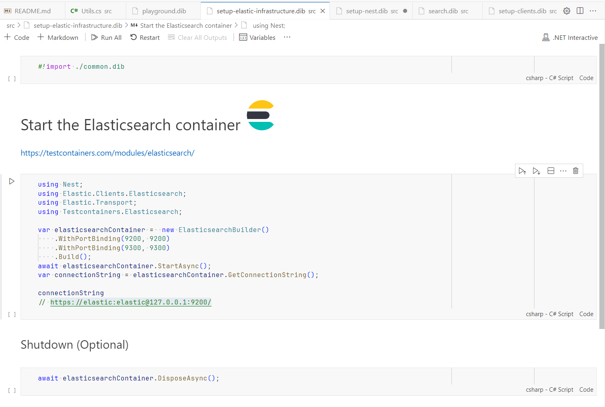

# Elasticsearch .NET Playground

This playground is a collection of notebooks that demonstrate how to use Elasticsearch.NET and NEST clients.

You may want to use this playground to learn more about Elasticsearch.NET and NEST clients or if you want to migration your existing code from NEST to Elasticsearch.NET.

> See [playground.dib](./playground.dib) to get started.

## References

* Elasticsearch.NET (latest) - <https://www.elastic.co/guide/en/elasticsearch/client/net-api/8.9/introduction.html>
* Migration Guide - <https://www.elastic.co/guide/en/elasticsearch/client/net-api/current/migration-guide.html>
* Elasticsearch.NET - <https://github.com/elastic/elasticsearch-net>
* NEST + Elasticsearch.NET in one doc - <https://www.elastic.co/guide/en/elasticsearch/client/net-api/7.17/introduction.html>
* .NET Interactive | Samples - <https://github.com/dotnet/interactive/tree/main/samples/notebooks/csharp>
* .NET Interactive - <https://github.com/dotnet/interactive/blob/main/docs/README.md>